# MiniCAD Report

陈佳伟 

3160102178

3160102178@zju.edu.cn

## 实现的功能

* 使用鼠标绘制以下图形：

  * 线段
  * 矩形
  * 椭圆
  * 填充的矩形
  * 多点折线：完成画图时，按下 `Enter` 键即可；选中折线要点击在线上而不是中间
  * 多边形：完成画图时，按下 `Enter` 键即可；选中多边形要点击在线上而不是中间
  * 文字块

  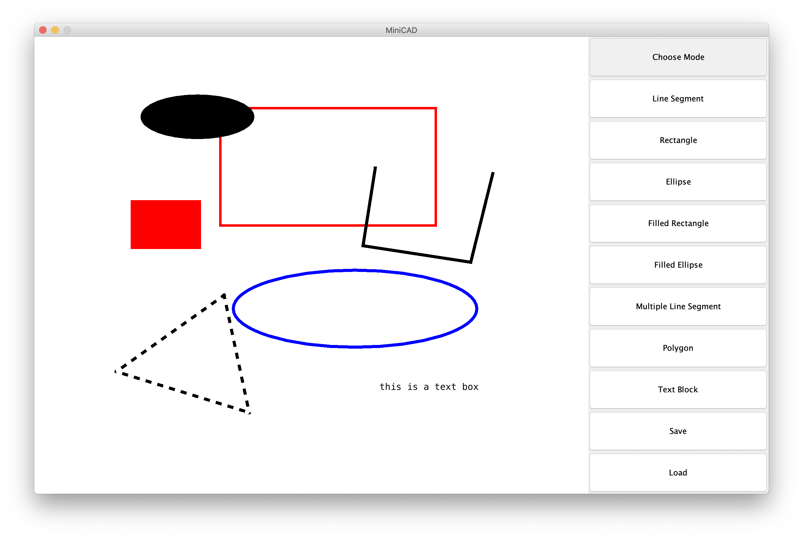

* 可以使用鼠标点选已经绘制的图形

  当图形被选中时，图形的边框用虚线显示，如下图。

  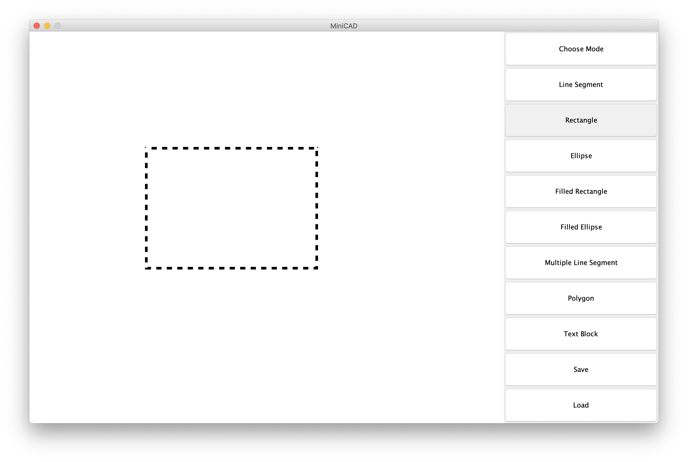

* 通过鼠标拖拽图形实现移动

* 通过滚动鼠标滚轮修改图形的大小

  滚轮向上滚动，图形变大；滚轮向下滚动，图形变小。

* 通过键盘改变图形的颜色

  `F3` : 将当前选中图形改变为默认颜色（黑色）

  `F4` : 将当前选中图形改变为红色

  `F5` : 将当前选中图形改变为蓝色

  `F6` : 将当前选中图形改变为黄色

  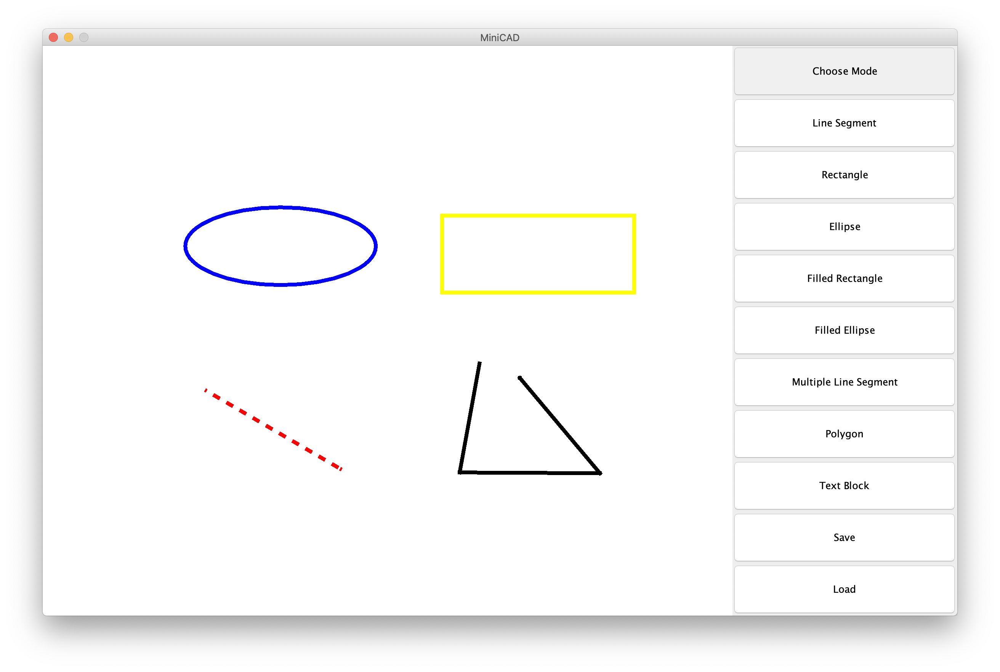

* 通过键盘增加线条粗细

  `F1` : 增加当前选中图形的线条粗细

  `F2` : 减少当前选中图形的线条粗细

  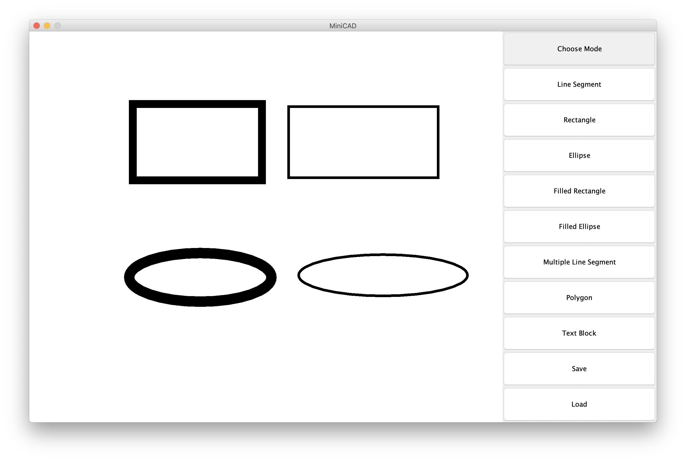

* 通过键盘输入改变文本块的内容

  当选中文字块的时候，文字会有外边框来表示选中。

  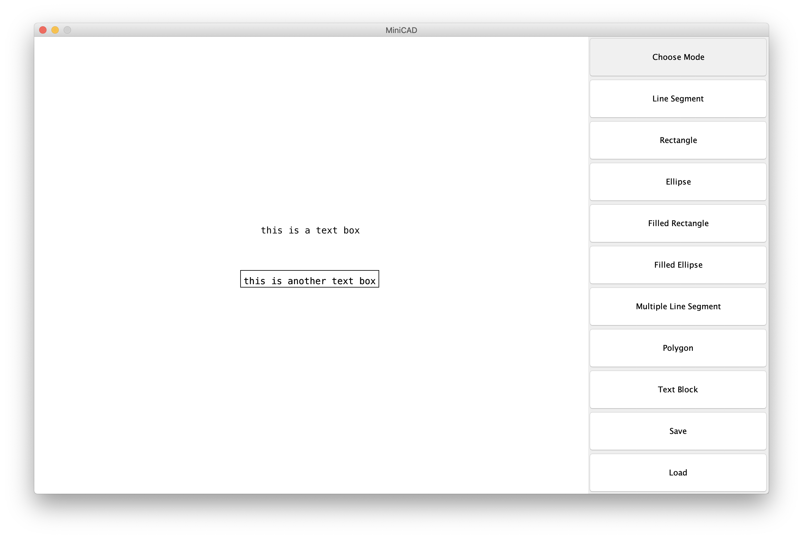

* 删除选中的图形

  选中要删除的图形，按 `Delete` 或 `Backspace`（ macOS 下为 `⌫` ） 可以删除图形。

* 将图形保存到文件/加载文件

  其中文件扩展名为 `.ser` 。

  保存：

  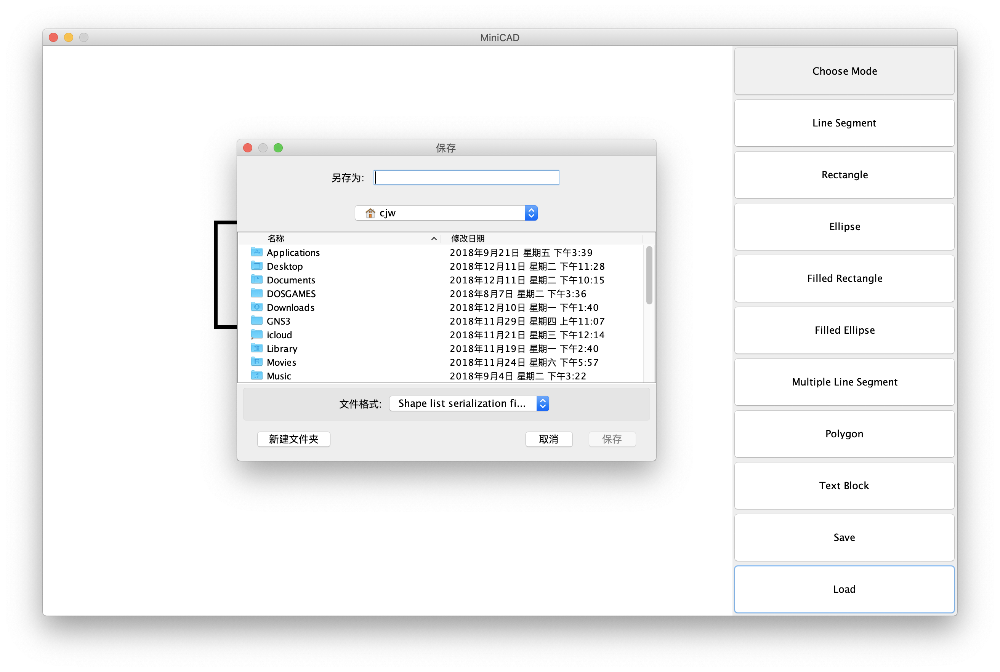

  载入：

  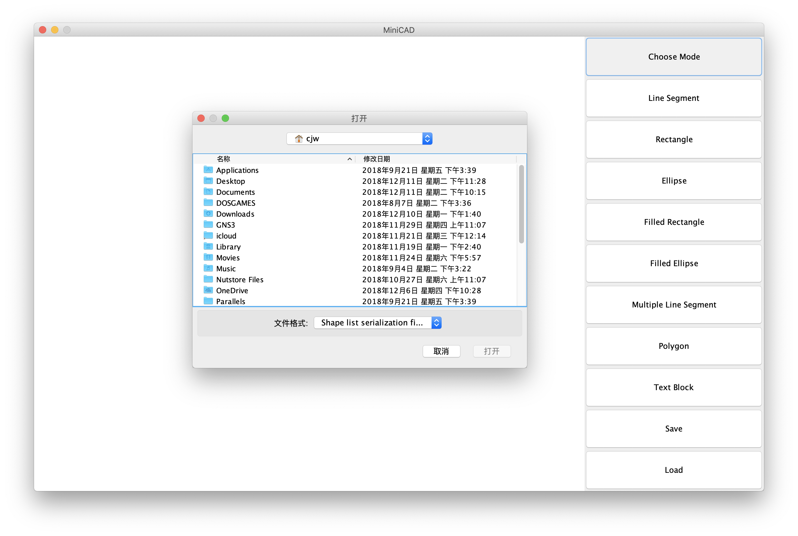

* 实验未提到的功能

  * 改变文字的字体

    `F7` : 修改字体为 Times

    `F8` : 修改字体为 Menlo

  * 改变文字的大小

    滚轮向上滚动，文字变大；滚轮向下滚动，文字变小。

## 测试环境

macOS 10.14.1

Java 1.8


## 运行方法

```shell
java -jar CAD.jar
```

## 类型系统设计

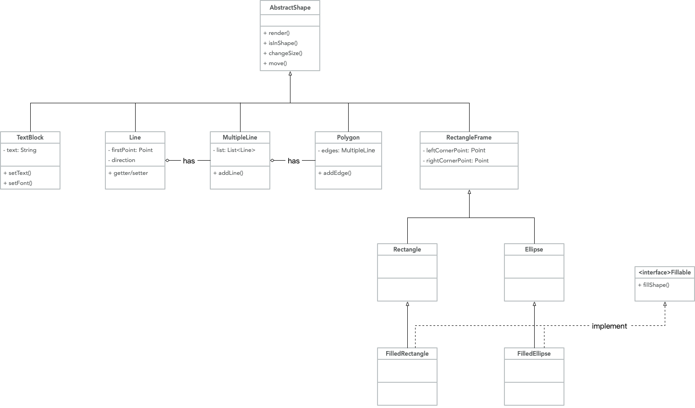

可以看见，所有图形都最终继承自抽象基类 `AbstractShape` ，而且这个基类拥有所有图形所共有的抽象方法 `render()` 、`isInShape()` 、`move()` 等。

类型 `MultipleLine` 中存储有 `List<Line>` ，从而是 `Line` 类型的聚集。而类型 `Polygon` 则持有一个 `MultipleLine` 的对象作为自己的边，从而能够复用 `MultipleLine` 的代码。

类 `Rectangle` 和 `Ellipse` 都可以由一个外接矩形来确定，因此都继承自 `RectangleFrame` ，以便复用确定位置的代码。

## 总体架构设计


当 GUI 界面接受了鼠标/键盘消息后，产生输入发送给状态机，引起状态机的状态变化。状态机根据输入来改变自己的状态以及输出。输出会改变 Model 中的内容，即存储在 `List<Shape>` 中的图形，在修改后通知 View 重绘图形。

## 状态机

### 状态机的图示

为了简洁起见，部分键盘输入与鼠标输入没有在图中画出。

* 画矩形/椭圆/线段

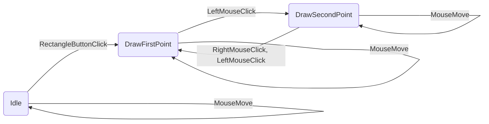


* 画折线/多边形

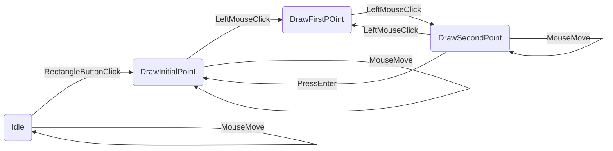


* 显示文字

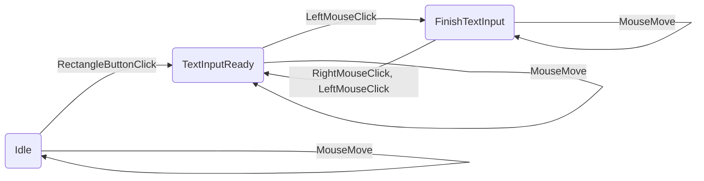


### 状态机的实现方法

本程序使用 Java 多态来实现状态机。

```java
abstract class State {
    abstract public State mouseLeftClick();
    abstract public State mouseRightClick();
    abstract public State keyPressed();
    ...
}
```

`State` 作为抽象基类，声明了所有可能的输入， 如 `mouseLeftClick` 、`mouseRightClick` 等。具体的状态继承了这个抽象基类并实现这些抽象方法。

当一个输入到来时，可以使用语句 `newState = currentState.input()` 来进行状态转换。

例如，对于处理鼠标的方法：

```java
if (isLeftMouseButton(event)) {
    newState = currentState.mouseLeftClick(event);
    setCurrentState(newState);
}
```


## 具体实现方法

### 处理输入

以鼠标输入为例，可以声明一个 `MouseAdapter` 的子类，并覆盖需要的方法：

```java
MouseAdapter mouseAdapter = new MouseAdapter() {
    @Override
    public void mouseClicked(MouseEvent e) {...}
    
    @Override
    public void mouseWheelMoved(MouseWheelEvent e) {...}
    
    ...
}
```

并且把 `mouseAdapter` 与控件进行绑定：

```java
drawingPanel.addMouseListener(mouseAdapter);
...
```


### Observer 模式

可以使用 Java bean 提供的 `PropertyChangeListener` 来实现监听效果，一旦一个属性发生改变，就通知置顶方法进行处理。

本实验中，主要应用在一旦 `shapeList` 中的图形发生改变，那么就通知 `drawingPanel` 重绘画面。

首先声明 listener：

```java
PropertyChangeSupport listeners = new PropertyChangeSupport(...);
```

并且在修改属性时添加 `firePropertyChange`，以进行通知

```java
listeners.firePropertyChange(prop, oldValue, newValue);
```

继承 `PropertyChangeListener` ，并进行覆盖方法：

```java
class ShapeListChangeListener implements PropertyChangeListener {
        @Override
        public void propertyChange(PropertyChangeEvent evt) {
			...
        }
    }
```

并将监听者与被监听者绑定：

```java
listeners.addPropertyChangeListener(listener);
```


### 绘图方法

绘图方法遍历整个 `shapeList` ，并调用每个 `Shape` 对象的 `render()` 方法进行绘图。

具体的 `render()` 方法可以直接调用 Swing 库的绘画方法。

## 遇到的问题与实现方法

* 数值精度问题

  最开始存储直线时，使用的是 Swing 的 `Point` 类存储直线两点，其中的坐标为整数值，但是在测试时发现由于要进行大小放缩，会产生小数的情况，而由于存储的是整数，所以会导致精度损失，多次放缩后可能导致直线位置/方向发生改变。最终解决方法是，内部存储使用 `double` ，但是当外部使用 `getter` 获取点的坐标时再再转换为整型。

* 拖拽图形问题

  先点击选中才能拖拽，和直接拖拽