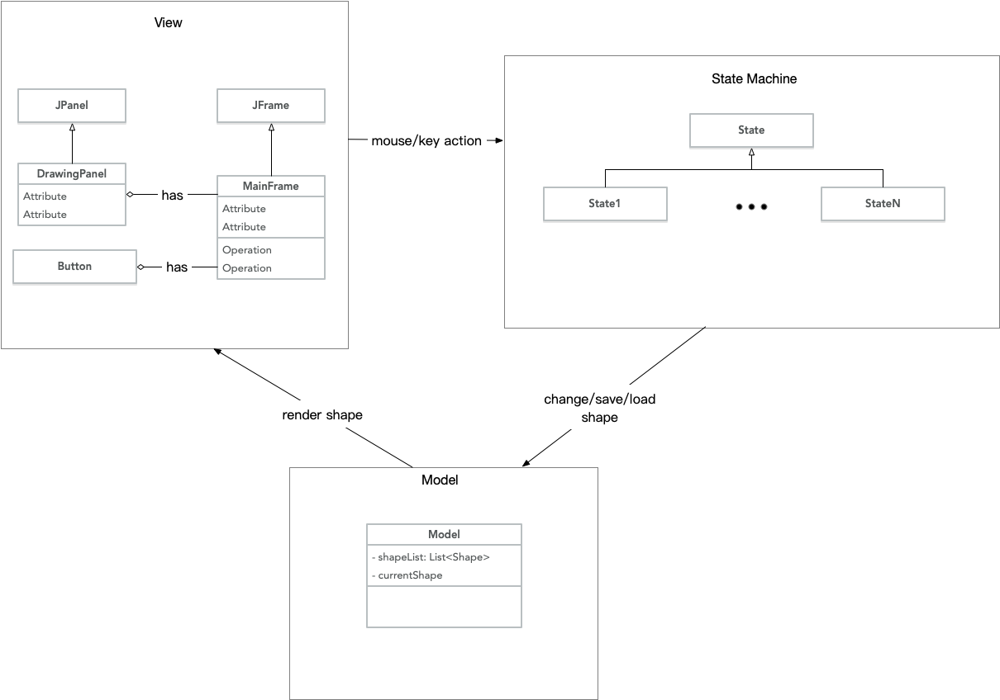

# MiniCAD Report

陈佳伟 

3160102178

3160102178@zju.edu.cn

## 实现的功能

* 使用鼠标绘制以下图形：

  * 线段
  * 矩形
  * 椭圆
  * 填充的矩形
  * 多点折线
  * 多边形
  * 文字块

  

* 可以使用鼠标点选已经绘制的图形

  当图形被选中时，图形的边框用虚线显示，如下图。

  

* 通过鼠标拖拽图形实现移动

* 通过滚动鼠标滚轮修改图形的大小

  滚轮向上滚动，图形变大；滚轮向下滚动，图形变小。

* 通过键盘改变图形的颜色

  `F3` : 将当前选中图形改变为默认颜色（黑色）

  `F4` : 将当前选中图形改变为红色

  `F5` : 将当前选中图形改变为蓝色

  `F6` : 将当前选中图形改变为黄色

  

* 通过键盘增加线条粗细

  `F1` : 增加当前选中图形的线条粗细

  `F2` : 减少当前选中图形的线条粗细

  

* 通过键盘输入改变文本块的内容

  当选中文字块的时候，文字会有外边框来表示选中。

  

* 删除选中的图形

  选中要删除的图形，按 `Delete` 或 `Backspace`（ macOS 下为 `⌫` ） 可以删除图形。

* 将图形保存到文件/加载文件

  其中文件扩展名为 `.ser` 。

  保存：

  

  载入：

  

* 实验未提到的功能

  * 改变文字的字体

    `F7` : 修改字体为 Times

    `F8` : 修改字体为 Menlo

  * 改变文字的颜色

    `F3` : 将当前选中文字改变为默认颜色（黑色）

    `F4` : 将当前选中文字改变为红色

    `F5` : 将当前选中文字改变为蓝色

    `F6` : 将当前选中文字改变为黄色

  * 改变文字的大小

    滚轮向上滚动，文字变大；滚轮向下滚动，文字变小。

## 运行方法

```shell
java -jar CAD.jar
```


## 类型系统设计


可以看见，所有图形都最终继承自抽象基类 `AbstractShape` ，而且这个基类拥有所有图形所共有的抽象方法 `render()` 、`isInShape()` 、`move()` 等。

类型 `MultipleLine` 中存储有 `List<Line>` ，从而是 `Line` 类型的聚集。而类型 `Polygon` 则持有一个 `MultipleLine` 的对象作为自己的边，从而能够复用 `MultipleLine` 的代码。

类 `Rectangle` 和 `Ellipse` 都可以由一个外接矩形来确定，因此都继承自 `RectangleFrame` ，以便复用确定位置的代码。

## 总体架构设计



当 GUI 界面接受了鼠标/键盘消息后，产生输入发送给状态机，引起状态机的状态变化。状态机根据输入来改变自己的状态以及输出。输出会改变 Model 中的内容，即存储在 `List<Shape>` 中的图形，在修改后通知 View 重绘图形。

## 状态机

### 状态机的图示

为了简洁起见，部分键盘输入与鼠标输入没有在图中画出。

* 画矩形/椭圆/线段


* 画折线/多边形


* 显示文字


### 状态机的实现方法

本程序使用 Java 多态来实现状态机。

```java
abstract class State {
    abstract public State mouseLeftClick();
    abstract public State mouseRightClick();
    abstract public State keyPressed();
    ...
}
```

`State` 作为抽象基类，拥有

## 具体实现方法


## 遇到的问题与实现方法

